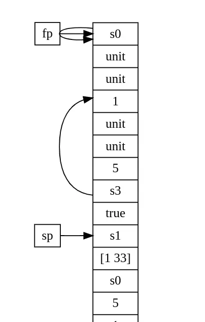

## So, what did I manage to accomplish this week?

Last time I decided to space out these reports a bit. It **must** be a good
idea, but the periods of silence make it more difficult to start writing.

Anyway, there is a lot of news going on. Mostly in relation to the VM for SBlang
and French.

### VM news

- I can now write a red-black tree in my own language (well, almost, I can
  insert and rebalance!)

- Recently, I added a layer of translation between the `codegen::FatInstr` and
  the resulting bytecode. This requred a lot from me. Many parts of the system
  had to be rewritten from scratch. But ultimately I think it turned out rather
  well. 

  This is how it looks like:

  ```
  Disasm of <insertNewValue>, text section number 0 in file 0x7ffe5cdfd150

            0:    get_at_fp        0e fd ff                -3
            3:    add_addr         05 02 00                2
            6:    load             13
            7:    get_at_fp        0e fe ff                -2
           10:    add_addr         05 02 00                2
           13:    load             13
           14:    get_at_fp        0e 02 00                2
           17:    get_at_fp        0e 01 00                1
           20:    cmp_eq           11
           21:    jump_if_false    0d 09 00                9
           24:    push_false       02
           25:    ret_fn           07
           26:    push_unit        03
           27:    jump             0c 04 00                4
           30:    push_unit        03
           31:    pop              06
           ...
  ```

- I also implemented interfaces for working with executables (these are called
  ElfFile, although their structure is simple enough to be called `a.out` or
  something). This granted me the ability to move worries of linking many
  different procedures from the compiler itself to the linker.

  ```
  class ElfFile {
   public:
    friend class debug::Disassembler;

    auto FindEntryPoint() -> std::optional<rt::InstrReference>;

    void operator+=(ElfFile&& other);

   private:
    ...

    void DropRelocationEntry(RelocationEntry& reloc);

    void Patch(RelocationEntry reloc, SymtabEntry symbol);

    void MergeText(std::vector<TextSection> sections);

    void MergeSymtab(std::vector<SymtabEntry> entries);

    void MergeRelocations(std::vector<RelocationEntry> entries);

   private:
    std::vector<TextSection> text_sections_;
    // TODO: std::vector<DataSection> data_sections;

    // Symbol information
    std::vector<SymtabEntry> symtab_sections_;
    std::vector<RelocationEntry> relocations_;

    // Debugging information
    std::vector<debug::DebugInfo> DIEs_;
  };
  ```

- There is an important piece there: debug info. It all started when I wanted a
  very simple thing: to be able to display the names of the variables on stack
  (and their types). This led me to a massive rabbit-hole of course, but I feel
  like I am getting there.

- This all ties to the "memory model" of the VM. How do I place everything in
  memory? How do I access what I have placed? 

  An example insight from this topic is that in my implementation not the
  `class Memory` has `class Stack` inside it, as I originally thought. But
  rather Stack has a block of memory. That is just because stack incapsulated
  in itself (a part of) the architectural state of the VM in the form of sp and
  fp.

  I also expect that memory model will help me debug things later on.

- Graphviz
  
  Yesterday I got working importing the stack state to dot language. I can now
  visualize it like this: 

  

  It's not very pretty for now but I expect that it will be extremely useful
  when I would want to debug heap or other memory regions.

- With the insight gained from the last few months I have been able to become
  an assistant to my professeur on the Compilers course in my university. 

  I am writing the tasks for beginners, like this:
  https://github.com/otakubeam/compilers-tasks/blob/master/tasks/2-parser.md

  Being able to teach somebody is a very precious thing. This is a second time
  for me and I wll try to continually improve.

  Roman Liposky whom I greatly greatly admire -- who is **the** reason that
  studying at MIPT has not been a complete failure for me -- admits that it
  takes a long time to become good. I'll try my best!

### French

The course of French in my uni is exactly what I hoped it would be. It helps me
to train with conjugations which would be difficult to do by myself. Also they
make me write longer texts as homework like the one below!

> Je m’appelle Tanaka Keiichi. Ma ville natale est Utukushima. C’est une très
> très petite ville. Nous avons seulement trois milles des âmes. La plupart des
> gens œuvrent dans les champes et les plantations. Il y a une école sur la
> colline and tous les élèves doivent monter ce tous les matins. À vrai dire,
> nous n’avons pas même une bibliothèque. Donc si quelqu'un veut lire quelque
> chose (un livre d'aventure peut-être? ou le manuel), il doit conduire à
> centre régional qu'est près notre ville. (Malheureuxment, non si près qu'on
> puisse simplement aller à pied.
> 
> 
> Mais, tout n’est pas si mal. Parce que nous avons la nature magnifique et
> picturesque. Les forêts à l'entourage des sanctuaires shinto sommes parfaits
> (ça veut dire intacte). Et pourtant nous n’avons pas beaucoup des
> installations sportives, nous avons beaucoup d'activité physique parce que
> c’est notre mode de la vie ici
> 
> 
> Le temps offrit la grande variété: il fait chaud en l'été, il fait frais au
> printemps, il pluie dans l'automne et il neige jusqu'aux genoux à l'hiver. La
> vie est plus aise ici, je pense.
>  
> 
> Recémment, je n’etais pas dans ma maison souvent. Je suis en train
> d'entraînement en Russe université, après tout. Mais il y a beaucoup de
> l'endroit où je veux visiter avec mes amis. Par exemple, le café à la rue
> principale. J'y ai été très heureux. C’est mes moments les plus chers. Ma
> jeunesse était là.

I am somewhat proud that I can write something like this already. I've been
readying "Les Misérables" by Victor Hugo. It's difficult, of course, but
manageable. He is one of the reasons to be learning the language for me.

### The Russian War

I see it with fear and trepidation. One of my close friends is leaving russia
for egypt and many of my colleagues decided to move too.

## Next week

I will try to make the visualzations a little better. Perhaphs graphviz can
actually display a slideshow? It would be very nice to see everything in
motion.
